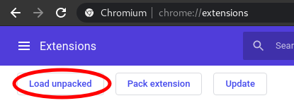
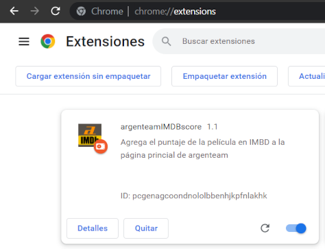

# argenteam.net << IMDb.com | Chrome & Firefox Extension
Extensión para Chrome, que agrega datos obtenidos de IMBd.com a la lista de películas en la página principal de argenteam.net

*La extensión no está publicada.*

## Chrome
### Instalación
Con los archivos en su ordenador, abra [chrome://extensions/](chrome://extensions/) en Chrome, luego seleccione "Load unpacked"

Se abrirá un gestor de archivos en el cuál deberá seleccionar la carpeta 'Extension'.

¡La extensión ya está lista!

## SOURCES

 - https://developer.chrome.com/extensions/getstarted
 - https://www.todojs.com/api-fetch-el-nuevo-estandar-que-permite-hacer-llamadas-http/
 - https://stackoverflow.com/questions/5927012/javascript-createelement-style-problem
 - https://stackoverflow.com/questions/9831074/dynamically-create-link-javascript
 - https://developer.mozilla.org/en-US/docs/Mozilla/Add-ons/WebExtensions/Your_first_WebExtension
